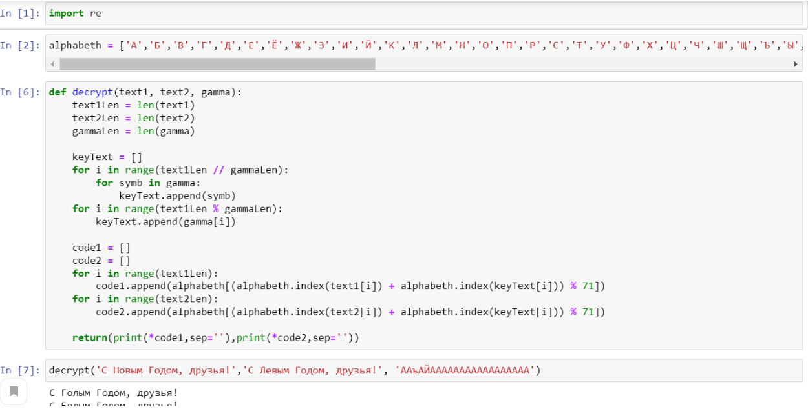

---
## Front matter
lang: ru-RU
title: Шифрование (кодирование) различных исходных текстов одним ключом
author: Радикорский Павел Михайлович
date: 2021, 18 december
## Formatting
toc: false
slide_level: 2
theme: metropolis
mainfont: PT Serif
romanfont: PT Serif
sansfont: PT Sans
monofont: PT Mono
mainfontoptions: Ligatures=TeX
romanfontoptions: Ligatures=TeX
sansfontoptions: Ligatures=TeX,Scale=MatchLowercase
monofontoptions: Scale=MatchLowercase
header-includes:
 - \metroset{progressbar=frametitle,sectionpage=progressbar,numbering=fraction}
 - '\makeatletter'
 - '\beamer@ignorenonframefalse'
 - '\makeatother'
aspectratio: 43
section-titles: true
---

# Цель работы

Освоить на практике применение режима однократного гаммирования на примере кодирования
различных исходных текстов одним ключом.

# Выполнение лабораторной работы

## 1)
Два текста кодируются одним ключом (однократное гаммирование).
Требуется не зная ключа и не стремясь его определить, прочитать оба текста. Необходимо
разработать приложение, позволяющее шифровать и дешифровать тексты P1 и P2 в режиме
однократного гаммирования. Приложение должно определить вид шифротекстов C1 и C2 обоих
текстов P1 и P2 при известном ключе ; Необходимо определить и выразить аналитически
способ, при котором злоумышленник может прочитать оба текста, не зная ключа и не
стремясь его определить.

## 2)
Функция, которая определяет вид шифротекстов C1 и C2 обоих текстов P1 и P2 при известном ключе
(рис. -@fig:002)

{ #fig:002 width=70% }

## 3)
Функция, которая позволяет злоумышленнику прочитать оба текста, не зная ключа и не
стремясь его определить
(рис. -@fig:003)

{ #fig:003 width=70% }

# Выводы

В результате выполнения работы я освоил на практике применение шифрования (кодирования) различных исходных текстов одним ключом.