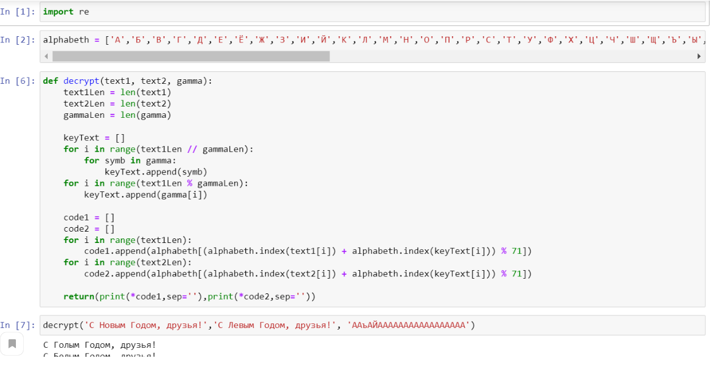
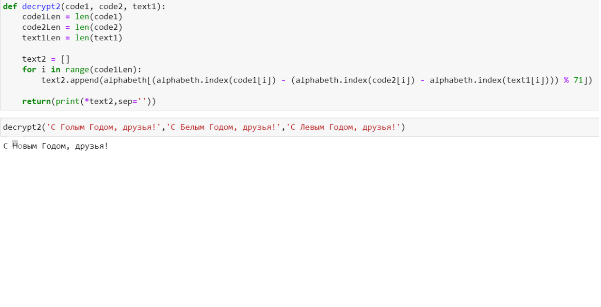

---
# Front matter
lang: "ru"
title: "Oтчёт по лабораторной работе №8"
subtitle: "Элементы криптографии. Шифрование (кодирование) различных исходных текстов одним ключом"
author: "Радикорский Павел Михайлович НФИбд-03-18"

# Formatting
toc-title: "Содержание"
toc: true # Table of contents
toc_depth: 2
lof: true # List of figures
lot: true # List of tables
fontsize: 12pt
linestretch: 1.5
papersize: a4paper
documentclass: scrreprt
mainfont: PT Serif
romanfont: PT Serif
sansfont: PT Sans
monofont: Consolas
mainfontoptions: Ligatures=TeX
romanfontoptions: Ligatures=TeX
sansfontoptions: Ligatures=TeX,Scale=MatchLowercase
monofontoptions: Scale=MatchLowercase
indent: true
pdf-engine: xelatex
header-includes:
  - \linepenalty=10 # the penalty added to the badness of each line within a paragraph (no associated penalty node) Increasing the value makes tex try to have fewer lines in the paragraph.
  - \interlinepenalty=0 # value of the penalty (node) added after each line of a paragraph.
  - \hyphenpenalty=50 # the penalty for line breaking at an automatically inserted hyphen
  - \exhyphenpenalty=50 # the penalty for line breaking at an explicit hyphen
  - \binoppenalty=700 # the penalty for breaking a line at a binary operator
  - \relpenalty=500 # the penalty for breaking a line at a relation
  - \clubpenalty=150 # extra penalty for breaking after first line of a paragraph
  - \widowpenalty=150 # extra penalty for breaking before last line of a paragraph
  - \displaywidowpenalty=50 # extra penalty for breaking before last line before a display math
  - \brokenpenalty=100 # extra penalty for page breaking after a hyphenated line
  - \predisplaypenalty=10000 # penalty for breaking before a display
  - \postdisplaypenalty=0 # penalty for breaking after a display
  - \floatingpenalty = 20000 # penalty for splitting an insertion (can only be split footnote in standard LaTeX)
  - \raggedbottom # or \flushbottom
  - \usepackage{float} # keep figures where there are in the text
  - \floatplacement{figure}{H} # keep figures where there are in the text
---

# Цель работы

Освоить на практике применение режима однократного гаммирования на примере кодирования
различных исходных текстов одним ключом.

# Выполнение лабораторной работы

Два текста кодируются одним ключом (однократное гаммирование).
Требуется не зная ключа и не стремясь его определить, прочитать оба текста. Необходимо
разработать приложение, позволяющее шифровать и дешифровать тексты P1 и P2 в режиме
однократного гаммирования. Приложение должно определить вид шифротекстов C1 и C2 обоих
текстов P1 и P2 при известном ключе ; Необходимо определить и выразить аналитически
способ, при котором злоумышленник может прочитать оба текста, не зная ключа и не
стремясь его определить.

Функция, которая определяет вид шифротекстов C1 и C2 обоих текстов P1 и P2 при известном ключе
Задаем алфавит из заглавных, строчных букв русского алфавита, !, ?, ., , и пробела.
На вход поступает два открытых текста, в виде массива символов, и ключ — гамму. Анализируем длину текста, «растягиваем» гамму до нужного размера и выполняем посимвольное сложение.
Функция выводит два шифротекста.
(рис. -@fig:002)

{ #fig:002 width=70% }

Функция, которая позволяет злоумышленнику прочитать оба текста, не зная ключа и не
стремясь его определить.
Если у злоумышленника есть оба шифротекста и один из открытых текстов, достаточно
сложить по модулю 2 оба шифротекста и открытый текст, и получим второй открытый текст, не зная
ключа.
(рис. -@fig:003)

{ #fig:003 width=70% }

# Выводы

В результате выполнения работы я освоил на практике применение шифрования (кодирования) различных исходных текстов одним ключом.
